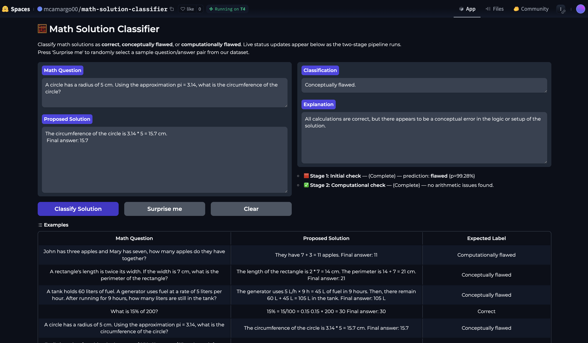

# Math Solution Classifier: A Locally-Runnable AI Grading Assistant

This project presents a proof-of-concept for a high-quality, automated math grading assistant that can run entirely on local, consumer-grade hardware. It is designed to classify a student's solution to a math word problem as **correct**, containing a **conceptual error**, or containing a **computational error**.

## The Problem: The High Cost of Diligent Grading

Grading is a universal challenge for educators. It is a task that is at once tedious and repetitive, yet it demands genuine concentration and effort to do justice to a student's work. For overworked teachers, particularly in primary and secondary education, the time spent on grading is a significant burden that detracts from lesson planning and direct student interaction.

Our goal is to lighten this burden with a reliable, private, and efficient digital teaching assistant.

## The Solution: A Hybrid, On-Device Classifier

Our **Math Solution Classifier** is a demonstration of our core thesis: it is possible to create a robust and nuanced grading assistant without relying on expensive, cloud-based frontier models.

The application, built with Gradio and hosted on Hugging Face Spaces, provides a simple interface for educators to quickly verify student solutions.

### [➡️ Try the Live Demo on Hugging Face Spaces!](https://huggingface.co/spaces/mcamargo00/math-solution-classifier)

## Why Small, Local Models? The Strategic Advantage

A common question is, "Why not just use a powerful API like GPT-4?" Our choice to build a system based on small, open-source models was a deliberate strategic decision, driven by principles that are critical for any real-world educational product.

1. **Data Privacy and Security:** Student data is sensitive and subject to strict privacy regulations. By designing a system that runs entirely on-device, we ensure that no student work ever leaves the user's machine. This privacy-first approach is non-negotiable in an educational context.

2. **Control, Stability, and Cost-Effectiveness:** Relying on closed-source APIs introduces significant business risk. API providers can change their pricing, deprecate models, or alter safety filters without warning, directly impacting the product's functionality and financial viability. Our self-contained system is sovereign, providing a stable, predictable, and cost-free experience for the end-user.

3. **Efficiency and "Right-Sizing AI":** We adhere to the principle that a task should be completed with the minimum necessary compute. Why use a massive, energy-intensive frontier model for a task that a smaller, specialized model can perform better? Our approach demonstrates that through intelligent system design and fine-tuning, open-source LLM's on the order of 1-4B parameters can outperform much larger "frontier" models on a specialized task, leading to a more efficient, and more sustainable solution.

## System Architecture: A Hybrid Approach

Instead of a single monolithic model, our pipeline intelligently decomposes the complex task of "grading" into two distinct sub-problems, each handled by a small, fine-tuned specialist model:

1. **Conceptual Error Detection (`microsoft/Phi-4-mini-instruct`):** A 4B parameter model fine-tuned as a binary classifier to assess the overall logic and reasoning of a solution.
2. **Computational Error Detection (`unsloth/gemma-3-1b-it`):** A 1B parameter model fine-tuned for a specific "equation extraction" task, which is then combined with a deterministic programmatic check to verify the arithmetic.

This hybrid architecture allows each component to excel at its specific role, leading to a system that is greater than the sum of its parts.

## Project Highlights & Detailed Breakdowns

This project is the culmination of a multi-stage effort involving a novel data generation pipeline, state-of-the-art fine-tuning techniques, and rigorous, multi-faceted evaluation.

### 📊 **Performance & Results**

Our fine-tuned pipeline proved to be not only more accurate but also significantly more robust and efficient than our `gemini-1.5-flash` baseline. The system excels as a **computational error specialist**, achieving **>92% recall** on this critical error class, a task where the baseline's performance was highly inconsistent. Furthermore, our pipeline is **3-4 times faster** than the API-based baseline.

> **For a full breakdown of the performance metrics and comparative analysis, see: [`/results/RESULTS.md`](./results/RESULTS.md)**

### 🛠️ **The Data Generation Pipeline**

The key to our success is a novel, programmatic data generation pipeline. Lacking a large, high-quality dataset, we built our own. The process begins by converting correct solutions from the GSM8K dataset into structured "Formalization Templates." We then use **Abstract Syntax Tree (AST) manipulation** to programmatically inject thousands of realistic computational and conceptual errors into the logic of the correct solutions. This allowed us to scale data creation far beyond what would be possible with manual annotation alone.

> **For a detailed explanation of this pipeline, see:**
>
> * **Overall Process:** [`/notebooks/data-pipeline/DATA-CREATION.md`](./notebooks/data-pipeline/DATA-CREATION.md)
> * **Templates:** [`/notebooks/data-pipeline/TEMPLATES.md`](./notebooks/data-pipeline/TEMPLATES.md)
> * **Error Injection:** [`/notebooks/data-pipeline/ERROR-INJECTION.md`](./notebooks/data-pipeline/ERROR-INJECTION.md)

### ⚙️ **Model Fine-Tuning**

We used state-of-the-art Parameter-Efficient Fine-Tuning (PEFT) techniques, specifically **LoRA**, to adapt our base models. The fine-tuning of the Gemma-3 model was significantly accelerated using the **Unsloth** library, which enabled us to complete the training process in under five minutes on a single Colab GPU.

> **For a technical deep-dive into the model architectures, the mathematics of LoRA, and the loss functions used, see: [`/notebooks/modelling/TECHNICAL-DETAILS.MD`](./notebooks/modelling/TECHNICAL-DETAILS.MD)**

## Repository Structure

* **`/app/`**: Contains the `app.py` source code and supporting files for the Gradio demo.
* **`/assets/`**: Contains images and other assets for the README.
* **`/data/`**: Contains all raw, intermediate, and final datasets.
* **`/notebooks/`**: Contains all Jupyter notebooks organized by function (data creation, modelling, evaluation).
* **`/results/`**: Contains the final prediction CSVs and performance plots from our analysis.
* **`/baseline/`**: Contains the notebooks and results for the `gemini-1.5-flash` baseline experiment.
