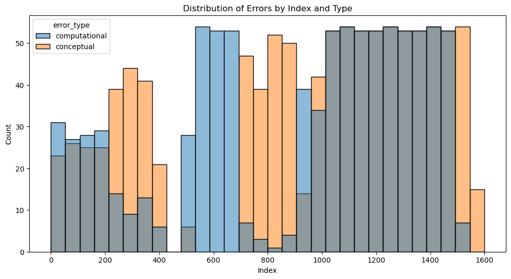

```python
from pathlib import Path
import json

# --- Path and Directory Definitions ---
def find_project_root(marker: str = ".git") -> Path:
    current_path = Path.cwd().resolve()
    while current_path != current_path.parent:
        if (current_path / marker).exists():
            return current_path
        current_path = current_path.parent
    raise FileNotFoundError(f"Could not find project root. Marker '{marker}' not found.")

PROJECT_ROOT = find_project_root()
DATA_DIR = PROJECT_ROOT / 'data'

# Yewei
DIR_1001_1500_COMPUTATIONAL = PROJECT_ROOT / 'yewei' / 'gsm8k_data' / 'computational'
DIR_1001_1500_CONCEPTUAL = PROJECT_ROOT / 'yewei' / 'gsm8k_data' / 'conceptual'

# Ling
DIR_1500_1599_CONCEPTUAL = DATA_DIR

# Mauro
DIR_500_999_MIXED = DATA_DIR / 'manually_gen_incorrect_answers_gsm8k'

# Ali
DIR_0_400_MIXED = PROJECT_ROOT / 'GSM8_Edited'

# Check if all the directories exist
for directory in [
    DIR_1001_1500_COMPUTATIONAL,
    DIR_1001_1500_CONCEPTUAL,
    DIR_1500_1599_CONCEPTUAL,
    DIR_500_999_MIXED,
    DIR_0_400_MIXED
]:
    if not directory.exists():
        print(f"Directory does not exist: {directory}")


filepaths = {
    # Yewei
    "1001_1500_computational": DIR_1001_1500_COMPUTATIONAL / "gsm8k_augmented_1001_1100_computational.json",
    "1001_1500_conceptual": DIR_1001_1500_CONCEPTUAL / "gsm8k_augmented_1001_1100_conceptual.json",
    "1101_1200_computational": DIR_1001_1500_COMPUTATIONAL / "gsm8k_augmented_1101_1200_computational.json",
    "1101_1200_conceptual": DIR_1001_1500_CONCEPTUAL / "gsm8k_augmented_1101_1200_conceptual.json",
    "1201_1300_computational": DIR_1001_1500_COMPUTATIONAL / "gsm8k_augmented_1201_1300_computational.json",
    "1201_1300_conceptual": DIR_1001_1500_CONCEPTUAL / "gsm8k_augmented_1201_1300_conceptual.json",
    "1301_1400_computational": DIR_1001_1500_COMPUTATIONAL / "gsm8k_augmented_1301_1400_computational.json",
    "1301_1400_conceptual": DIR_1001_1500_CONCEPTUAL / "gsm8k_augmented_1301_1400_conceptual.json",
    "1401_1500_computational": DIR_1001_1500_COMPUTATIONAL / "gsm8k_augmented_1401_1500_computational.json",
    "1401_1500_conceptual": DIR_1001_1500_CONCEPTUAL / "gsm8k_augmented_1401_1500_conceptual.json",

    # Ling
    "1500_1599_conceptual": DIR_1500_1599_CONCEPTUAL / "1500_1599_conceptual.jsonl",

    # Mauro
    "500_999_mixed": DIR_500_999_MIXED / "gsm8k_annotated_500_to_999.jsonl",

    # Ali
    "0_100_mixed": DIR_0_400_MIXED / "0-100.json",
    "101-200_mixed": DIR_0_400_MIXED / "101-200.json",
    "201-300_mixed": DIR_0_400_MIXED / "201_to_300.json",
    "301-400_mixed": DIR_0_400_MIXED / "301_to_400.json"
}

# Output dir for the merged jsonl file
OUTPUT_DIR = DATA_DIR

# Load all files into a single dictionary
all_data = {}
for key, filepath in filepaths.items():
    try:
        with open(filepath) as f:
            if filepath.suffix == ".jsonl":
                # Handle JSONL files
                all_data[key] = [json.loads(line) for line in f]
            else:
                # Handle JSON files
                all_data[key] = json.load(f)
    except Exception as e:
        print(f"Error loading {filepath}: {e}")


from datasets import load_dataset

GSM8K_TRAIN = load_dataset("gsm8k", "main", split="train")

```


```python
import re
import json
from pathlib import Path
from typing import Dict, List, Union, Optional
from datasets import Dataset

def extract_start_index(key: str) -> int:
    """
    Given a key like "1001_1500_conceptual" or "101-200_mixed",
    return the first integer (e.g. 1001 or 101).
    """
    m = re.search(r"(\d+)", key)
    if not m:
        raise ValueError(f"No integer start index found in key '{key}'")
    return int(m.group(1))

def build_question_index_map(dataset: Dataset) -> Dict[str, int]:
    """
    Build a dict mapping each question string to its index in the GSM8K train split.
    """
    return {
        sample["question"].strip(): idx
        for idx, sample in enumerate(dataset)
    }

def merge_augmented_data(
    all_data: Dict[str, Union[List[dict], dict]],
    filepaths: Dict[str, Path],
    gsm8k_train: Dataset,
    output_dir: Union[str, Path],
    project_root: Path,
    output_filename: str = "manually_generated_errors.jsonl"
) -> None:
    """
    Merge all of your JSON/JSONL files into a single JSONL, adding:
      - "index": the example’s index in the GSM8K train split
      - "filepath": the source filepath, made relative to project_root

    Args:
        all_data:       mapping from your file-key (e.g. "0_100_mixed") to list or dict of records
        filepaths:      same keys → Path to each original JSON/JSONL file
        gsm8k_train:    the HuggingFace Dataset for "gsm8k" train split
        output_dir:     directory in which to write the merged JSONL
        project_root:   Path to your project root, used to relativize filepaths
        output_filename: name of the output JSONL file (default: "merged_augmented_data.jsonl")
    """
    output_dir = Path(output_dir)
    output_dir.mkdir(parents=True, exist_ok=True)
    out_path = output_dir / output_filename

    # build question → index lookup
    q2idx = build_question_index_map(gsm8k_train)

    total_written = 0
    with open(out_path, "w", encoding="utf-8") as fout:
        for key, records in all_data.items():
            records_list = records if isinstance(records, list) else [records]
            start_idx = extract_start_index(key)
            src_path: Optional[Path] = filepaths.get(key)

            # compute filepath relative to project_root (or fallback)
            if src_path is not None:
                try:
                    rel_fp = src_path.relative_to(project_root)
                except ValueError:
                    rel_fp = src_path
            else:
                rel_fp = Path(key)

            for i, rec in enumerate(records_list):
                q = rec.get("question", "").strip()
                idx = q2idx.get(q, start_idx + i)
                merged = {
                    **rec,
                    "index": idx,
                    "filepath": rel_fp.as_posix()
                }
                fout.write(json.dumps(merged, ensure_ascii=False) + "\n")
                total_written += 1

    print(f"Merged {total_written} records → {out_path}")
```


```python
merge_augmented_data(
    all_data=all_data,
    filepaths=filepaths,
    gsm8k_train=GSM8K_TRAIN,
    output_dir=OUTPUT_DIR,
    project_root=PROJECT_ROOT
)
```

    Merged 1963 records → /Users/arvindsuresh/Documents/Github/Erdos-DL-June25-Math/data/manually_generated_errors.jsonl


```python
import json
from datasets import load_dataset
from pathlib import Path
from typing import Optional

def verify_merged_jsonl(
    jsonl_path: Path,
    gsm8k_train=None,
    max_display: int = 10
) -> None:
    """
    Verify that each 'question' in the merged JSONL matches the
    GSM8K train split question at the recorded 'index'.

    Args:
        jsonl_path:    Path to your merged_augmented_data.jsonl
        gsm8k_train:   (optional) pre-loaded Dataset; if None, we'll load it for you
        max_display:   number of mismatches to print in detail
    """
    # 1) load GSM8K if not provided
    if gsm8k_train is None:
        gsm8k_train = load_dataset("gsm8k", "main", split="train")

    total = 0
    mismatches = []

    # 2) iterate merged file
    with open(jsonl_path, "r", encoding="utf-8") as f:
        for line in f:
            total += 1
            rec = json.loads(line)
            idx = rec.get("index")
            merged_q = rec.get("question", "").strip()

            # 3) fetch original
            try:
                orig_q = gsm8k_train[idx]["question"].strip()
            except (IndexError, KeyError, TypeError):
                mismatches.append((total, idx, merged_q, None))
                continue

            # 4) compare
            if merged_q != orig_q:
                mismatches.append((total, idx, merged_q, orig_q))

    # 5) report
    print(f"Checked {total} records.")
    if not mismatches:
        print("✅ All questions match the GSM8K dataset.")
    else:
        print(f"⚠️  Found {len(mismatches)} mismatches:")
        for record_num, idx, merged_q, orig_q in mismatches[:max_display]:
            print(f"\n  • Record #{record_num} (index={idx}):")
            print(f"      Merged : {merged_q!r}")
            if orig_q is None:
                print("      Original: <index out of range>")
            else:
                print(f"      Original: {orig_q!r}")
        if len(mismatches) > max_display:
            print(f"\n  ...plus {len(mismatches)-max_display} more.")
```


```python
verify_merged_jsonl(
    jsonl_path=OUTPUT_DIR / "manually_generated_errors.jsonl",
    gsm8k_train=GSM8K_TRAIN,
    max_display=10
)
```

    Checked 1963 records.
    ⚠️  Found 9 mismatches:
    
      • Record #1003 (index=1502):
          Merged : "Dani brings two and half dozen cupcakes for her 2nd-grade class.  There are 27 students (including Dani), 1 teacher, and 1 teacher's aid.  If 3 students called in sick that day, how many cupcakes are left after Dani gives one to everyone in the class?"
          Original: 'Dani brings two and half dozen cupcakes for her 2nd-grade class.  There are 27 students (including Dani), 1 teacher, and 1 teacher’s aid.  If 3 students called in sick that day, how many cupcakes are left after Dani gives one to everyone in the class?'
    
      • Record #1014 (index=1513):
          Merged : "Tom's cat is 8 years old.  His rabbit is half the age of his cat.  His dog is three times as old as his rabbit.  How old is the dog?"
          Original: 'Tom’s cat is 8 years old.  His rabbit is half the age of his cat.  His dog is three times as old as his rabbit.  How old is the dog?'
    
      • Record #1029 (index=1528):
          Merged : "Gabby is saving money to buy a new makeup set. The makeup set costs $65 and she already has $35. Gabby's mom gives her an additional $20. How much money does Gabby need to buy the set?"
          Original: 'Gabby is saving money to buy a new makeup set. The makeup set costs $65 and she already has $35. Gabby’s mom gives her an additional $20. How much money does Gabby need to buy the set?'
    
      • Record #1040 (index=1539):
          Merged : "Chris is trying to sell his car for $5200 and has gotten two price offers. One buyer offered to pay the full price if Chris would pay for the car maintenance inspection, which cost a tenth of Chris's asking price. The other buyer agreed to pay the price if Chris replaced the headlights for $80 and the tires for three times as much. What is the difference between the amounts Chris will earn from the two offers?"
          Original: 'Chris is trying to sell his car for $5200 and has gotten two price offers. One buyer offered to pay the full price if Chris would pay for the car maintenance inspection, which cost a tenth of Chris’s asking price. The other buyer agreed to pay the price if Chris replaced the headlights for $80 and the tires for three times as much. What is the difference between the amounts Chris will earn from the two offers?'
    
      • Record #1045 (index=1544):
          Merged : "Ken can do 20 sit-ups without stopping. Nathan can do twice as many, and Bob can do half the number of Ken and Nathan's combined sit-ups. How many more sit-ups can Nathan do compared to Bob?"
          Original: 'Ben will receive a bonus of $1496. He chooses to allocate this amount as follows: 1/22 for the kitchen, 1/4 for holidays and 1/8 for Christmas gifts for his 3 children. How much money will he still have left after these expenses?'
    
      • Record #1057 (index=1556):
          Merged : 'Miss Walter has 50 gold stickers. She also has twice as many silver stickers as gold stickers, and 20 fewer bronze stickers than silver stickers.  She wants to give the same number of stickers to each of her 5 students. How many stickers will one school receive?'
          Original: 'Alyana has a pizza that is cut into 16 slices. After she and her friends finish eating, there are 4 slices left. If each of them ate 2 slices of pizza, how many people ate the pizza?'
    
      • Record #1060 (index=1559):
          Merged : 'Jaynie wants to make leis for the graduation party. It will take 2 and half dozen plumeria flowers to make 1 lei. If she wants to make 4 leis, how many plumeria flowers must she pick from the trees in her yard?'
          Original: 'Maci is planning for the new school year and goes to the store to buy pens. She needs ten blue pens and 15 red pens. If a blue pen costs ten cents each and a red pen costs twice as much as the blue pen, how much money does Maci pay for the pens?'
    
      • Record #1061 (index=1560):
          Merged : 'The Great Pyramid of Giza was the tallest man-made structure on earth for almost 4000 years. It is 20 feet taller than 500 feet, and 234 feet wider than it is tall. What is the sum of the height and width of the Great Pyramid of Giza in feet?'
          Original: 'Yvette wants to frame a new picture. When she goes to her local frame shop, she finds out that the frame she wanted is 20% more expensive than her budget of $60. If she paid for a smaller frame at 3/4 the new price of the frame she initially intended to buy, how much money did she remain with?'
    
      • Record #1962 (index=399):
          Merged : "Sam works at the Widget Factory, assembling Widgets. He can assemble 1 widget every 10 minutes. Jack from the loading dock can help assemble widgets when he doesn't have anything else to do. When he helps, they put together 2 complete widgets every 15 minutes. Recently the factory hired Tony to help assemble widgets. Being new to the job, he doesn't work as fast as Sam or Jack. Yesterday Sam worked for 6 hours before he had to leave work early for a dentist appointment. Jack was able to help out for 4 hours before he had to go back to the loading dock to unload a new shipment of widget materials. Tony worked the entire 8-hour shift. At the end of the day, they had completed 76 widgets. How long does it take Tony to assemble a Widget, in minutes?"
          Original: "Sam works at the Widget Factory, assembling Widgets. He can assemble 1 widget every 10 minutes. Jack from the loading dock can help assemble widgets when he doesn't have anything else to do. When he helps, they put together 2 complete widgets every 15 minutes. Recently the factory hired Tony to help assemble widgets. Being new to the job, he doesn't work as fast as Sam or Jack. Yesterday Sam worked for 6 hours before he had to leave work early for a dentist appointment. Jack was able to help out for 4 hours before he had to go back to the loading dock to unload a new shipment of widget materials. Tony worked the entire 8-hour shift. At the end of the day, they had completed 68 widgets. How long does it take Tony to assemble a Widget, in minutes?"


```python
import unicodedata
import re

def sanitize_text(text: str) -> str:
    """
    Normalize and clean up a solution string for consistent line splitting.

    Steps:
      1. Unicode-normalize to NFC form.
      2. Convert all CRLF or CR line endings to LF.
      3. Strip trailing whitespace on each line.
      4. Remove any zero-width or non-printable characters.
      5. Trim leading/trailing blank lines.

    Args:
        text: raw solution string (may contain weird unicode or mixed line endings)
    Returns:
        cleaned text with uniform LF endings and no extraneous trailing spaces.
    """
    # 1) Unicode normalize
    text = unicodedata.normalize("NFC", text)

    # 2) Normalize line endings
    text = text.replace("\r\n", "\n").replace("\r", "\n")

    # 3) Strip trailing whitespace and remove non-printables
    #    (e.g. zero-width spaces, etc.)
    def clean_line(line: str) -> str:
        # remove zero-width / control chars except newline
        line = re.sub(r"[\u200B-\u200D\uFEFF]", "", line)
        return line.rstrip()

    lines = [clean_line(ln) for ln in text.split("\n")]

    # 4) Trim leading/trailing blank lines
    while lines and lines[0] == "":
        lines.pop(0)
    while lines and lines[-1] == "":
        lines.pop()

    return "\n".join(lines)
```


```python
import re
import json
from pathlib import Path
from typing import Dict, List, Optional, Union
from datasets import Dataset, load_dataset

def build_solution_mapping_from_text_nosanitize(
    solution_text: str,
    exclude_FA: bool = True
) -> Dict[str, str]:
    """
    Split raw solution text into a line-numbered dict, without any sanitization.

    Args:
        solution_text: the full multi-line solution string
        exclude_FA:    if True, drop the final "#### {answer}" line entirely
    Returns:
        mapping of "L1", "L2", … to each non-blank line of solution_text
        (and optionally "FA" if exclude_FA=False)
    """
    lines = [ln.strip() for ln in solution_text.splitlines() if ln.strip()]
    mapping: Dict[str, str] = {}

    # if last line is "#### {digits}" treat as final answer
    if lines and re.match(r"^####\s*[\d\.,]+$", lines[-1]):
        fa_line = lines.pop(-1).strip()
        if not exclude_FA:
            mapping["FA"] = fa_line

    for i, line in enumerate(lines, start=1):
        mapping[f"L{i}"] = line

    return mapping


def compute_first_erroneous_line_nosanitize(
    input_jsonl: Union[str, Path],
    output_jsonl: Optional[Union[str, Path]] = None,
    gsm8k_train: Optional[Dataset] = None
) -> Dict[str, List[int]]:
    """
    Like compute_first_erroneous_line, but uses the nosanitize mapping.

    Returns dict with:
      - correct_answer_mismatch
      - wrong_answer_full_matches
      - wrong_answer_weird

    And (if output_jsonl is set) writes an annotated JSONL with
    'erroneous_line_number' added where appropriate.
    """
    if gsm8k_train is None:
        gsm8k_train = load_dataset("gsm8k", "main", split="train")

    cam, wafm, waw = [], [], []
    annotated: List[dict] = []

    with open(input_jsonl, "r", encoding="utf-8") as fin:
        for raw in fin:
            rec = json.loads(raw)
            idx = rec["index"]

            ans_map   = build_solution_mapping_from_text_nosanitize(rec["answer"])
            wrong_map = build_solution_mapping_from_text_nosanitize(rec["wrong_answer"])
            ds_text   = gsm8k_train[idx]["answer"]
            ds_map    = build_solution_mapping_from_text_nosanitize(ds_text)

            # 1) correct-answer mismatch?
            if ans_map != ds_map:
                cam.append(idx)
                annotated.append(rec)
                continue

            # 2) wrong-answer exactly matches full solution?
            if wrong_map == ds_map:
                wafm.append(idx)
                annotated.append(rec)
                continue

            # find first line where wrong ≠ dataset
            keys = sorted(ds_map.keys(), key=lambda k: int(k[1:]))
            first_diff = next((k for k in keys if wrong_map.get(k) != ds_map.get(k)), None)

            # 3) weird: any later line matches again?
            is_weird = False
            if first_diff:
                start = int(first_diff[1:])
                for k in keys:
                    if int(k[1:]) > start and wrong_map.get(k) == ds_map.get(k):
                        waw.append(idx)
                        is_weird = True
                        break

            if is_weird:
                annotated.append(rec)
                continue

            # 4) normal: annotate the first differing line
            if first_diff:
                rec["erroneous_line_number"] = first_diff
            annotated.append(rec)

    if output_jsonl:
        out = Path(output_jsonl)
        with out.open("w", encoding="utf-8") as fout:
            for rec in annotated:
                fout.write(json.dumps(rec, ensure_ascii=False) + "\n")
        print(f"Wrote annotated JSONL to {out}")

    return {
        "correct_answer_mismatch": cam,
        "wrong_answer_full_matches": wafm,
        "wrong_answer_weird": waw
    }
```


```python
results = compute_first_erroneous_line_nosanitize(
    input_jsonl= DATA_DIR / "manually_generated_errors.jsonl",
    output_jsonl= DATA_DIR / "manually_generated_errors_final.jsonl"
)

```

    Wrote annotated JSONL to /Users/arvindsuresh/Documents/Github/Erdos-DL-June25-Math/data/manually_generated_errors_final.jsonl


```python
print("Correct answers from manually gen files that don't match GSM8K answers:")
print(results["correct_answer_mismatch"])
print()

print("Wrong answers that fully match GSM8K answers:")
print(results["wrong_answer_full_matches"])
print()

print("Wrong answers that are weird (one line differs, but later lines match):")
print(results["wrong_answer_weird"])
print()
```

    Correct answers from manually gen files that don't match GSM8K answers:
    [1513, 1533, 1539, 1544, 1556, 1557, 1559, 1560, 3, 12, 20, 44, 105, 108, 109, 137, 167, 168, 198, 200, 269, 317, 378, 399]
    
    Wrong answers that fully match GSM8K answers:
    [881]
    
    Wrong answers that are weird (one line differs, but later lines match):
    [1001, 1019, 1028, 1030, 1031, 1033, 1039, 1042, 1054, 1062, 1066, 1068, 1069, 1072, 1073, 1074, 1075, 1085, 1093, 1001, 1010, 1030, 1031, 1066, 1069, 1102, 1112, 1124, 1125, 1131, 1133, 1136, 1140, 1143, 1149, 1152, 1153, 1154, 1156, 1159, 1160, 1163, 1164, 1169, 1192, 1193, 1196, 1122, 1125, 1146, 1149, 1184, 1189, 1196, 1202, 1205, 1206, 1212, 1213, 1219, 1221, 1222, 1225, 1226, 1227, 1229, 1233, 1242, 1250, 1251, 1253, 1256, 1259, 1264, 1267, 1269, 1271, 1274, 1286, 1289, 1292, 1295, 1205, 1219, 1231, 1250, 1251, 1269, 1289, 1292, 1302, 1354, 1361, 1362, 1363, 1364, 1372, 1375, 1379, 1380, 1385, 1391, 1393, 1302, 1334, 1338, 1375, 1385, 1391, 1393, 1408, 1410, 1412, 1413, 1418, 1422, 1428, 1430, 1435, 1436, 1437, 1440, 1444, 1446, 1447, 1448, 1449, 1455, 1456, 1465, 1472, 1473, 1486, 1489, 1499, 1413, 1418, 1428, 1435, 1440, 1446, 1481, 1489, 1508, 1536, 537, 549, 562, 573, 578, 580, 592, 598, 602, 668, 716, 783, 803, 808, 812, 873, 988, 18, 25, 27, 30, 40, 42, 56, 90, 123, 139, 147, 157, 162, 173, 182, 191, 192, 199, 215, 218, 219, 222, 238, 243, 257, 284, 287, 288, 300, 328, 329, 355, 359, 389]
    


```python
import json
from pathlib import Path

# --- 1. Define Paths ---

input_path = DATA_DIR / "manually_generated_errors_final.jsonl"
output_path = input_path.with_name(f"{input_path.stem}_pretty.json")

# --- 2. Define the Conversion Function ---
def convert_jsonl_to_pretty_json(
    jsonl_input_path: Path,
    json_output_path: Path,
    indent: int = 2
):
    """
    Reads a JSONL file and writes its contents as a single,
    nicely formatted JSON array to a new file.

    Args:
        jsonl_input_path: Path to the source JSONL file.
        json_output_path: Path to the destination pretty-printed JSON file.
        indent: The indentation level for the output JSON.
    """
    print(f"Reading records from: {jsonl_input_path}")
    records = []
    try:
        with jsonl_input_path.open("r", encoding="utf-8") as f_in:
            for line in f_in:
                # Ignore blank lines
                if line.strip():
                    records.append(json.loads(line))

        print(f"Successfully read {len(records)} records.")

        print(f"Writing nicely formatted JSON to: {json_output_path}")
        with json_output_path.open("w", encoding="utf-8") as f_out:
            # Use json.dump to write the entire list with indentation
            json.dump(records, f_out, indent=indent, ensure_ascii=False)

        print("\nConversion complete.")
        print(f"View the formatted output at: {json_output_path}")

    except FileNotFoundError:
        print(f"ERROR: Input file not found at '{jsonl_input_path}'")
    except json.JSONDecodeError as e:
        print(f"ERROR: Failed to parse JSON from '{jsonl_input_path}'.")
        print(f"Details: {e}")
    except Exception as e:
        print(f"An unexpected error occurred: {e}")

# --- 3. Execute the Conversion ---
convert_jsonl_to_pretty_json(input_path, output_path)
```

    Reading records from: /Users/arvindsuresh/Documents/Github/Erdos-DL-June25-Math/data/manually_generated_errors_final.jsonl
    Successfully read 1963 records.
    Writing nicely formatted JSON to: /Users/arvindsuresh/Documents/Github/Erdos-DL-June25-Math/data/manually_generated_errors_final_pretty.json
    
    Conversion complete.
    View the formatted output at: /Users/arvindsuresh/Documents/Github/Erdos-DL-June25-Math/data/manually_generated_errors_final_pretty.json


```python
import json
import csv
from pathlib import Path

# --- 1. Define Paths ---

jsonl_input_path = DATA_DIR / "manually_generated_errors_final.jsonl"
csv_output_path = jsonl_input_path.with_suffix(".csv")


# --- 2. Define the Conversion Function ---
def convert_jsonl_to_csv(jsonl_path: Path, csv_path: Path):
    """
    Reads a JSONL file and converts it to a CSV file.

    It dynamically creates headers from all keys found in the JSONL objects
    to ensure no data is lost, even with inconsistent record structures.
    """
    try:
        print(f"Reading records from: {jsonl_path}")
        records = []
        with jsonl_path.open("r", encoding="utf-8") as f_in:
            for line in f_in:
                if line.strip():
                    records.append(json.loads(line))
        
        if not records:
            print("Input file is empty. No CSV file created.")
            return

        print(f"Found {len(records)} records. Preparing to write to CSV.")

        # Dynamically create the header from all unique keys in the dataset
        all_keys = set()
        for record in records:
            all_keys.update(record.keys())
        # Sort headers for consistent column order
        headers = sorted(list(all_keys))

        with csv_path.open("w", newline="", encoding="utf-8") as f_out:
            writer = csv.DictWriter(f_out, fieldnames=headers)
            
            # Write the header row
            writer.writeheader()
            
            # Write all records
            writer.writerows(records)

        print("\nConversion complete.")
        print(f"CSV file saved to: {csv_path}")

    except FileNotFoundError:
        print(f"ERROR: Input file not found at '{jsonl_path}'")
    except Exception as e:
        print(f"An unexpected error occurred: {e}")


# --- 3. Execute the Conversion ---
convert_jsonl_to_csv(jsonl_input_path, csv_output_path)
```

    Reading records from: /Users/arvindsuresh/Documents/Github/Erdos-DL-June25-Math/data/manually_generated_errors_final.jsonl
    Found 1963 records. Preparing to write to CSV.
    
    Conversion complete.
    CSV file saved to: /Users/arvindsuresh/Documents/Github/Erdos-DL-June25-Math/data/manually_generated_errors_final.csv


```python
import pandas as pd
df = pd.read_csv(csv_output_path)

# replace 'computational_error' with 'computational' and 'conceptual_error' with 'conceptual'
df['error_type'] = df['error_type'].replace({
    'computational_error': 'computational',
    'conceptual_error': 'conceptual'
})

# save the modified DataFrame back to CSV
df.to_csv(csv_output_path, index=False)
print(f"Updated CSV saved to: {csv_output_path}")

# Display unique values in 'erroneous_line_number' and 'error_type'
for col in ['erroneous_line_number', 'error_type']:
    print(f"Column '{col}' unique values:")
    print(df[col].value_counts())
    print("-"*40)
```

    Updated CSV saved to: /Users/arvindsuresh/Documents/Github/Erdos-DL-June25-Math/data/manually_generated_errors_final.csv
    Column 'erroneous_line_number' unique values:
    erroneous_line_number
    L2    533
    L1    491
    L3    374
    L4    191
    L5     83
    L6     45
    L7     17
    L8      4
    L9      2
    Name: count, dtype: int64
    ----------------------------------------
    Column 'error_type' unique values:
    error_type
    conceptual       1043
    computational     920
    Name: count, dtype: int64
    ----------------------------------------


```python
df_conceptual = df[df['error_type'] == 'conceptual']

# Print list of duplicated indices in the conceptual errors
duplicated_indices = df_conceptual.index[df_conceptual.index.duplicated()].tolist()
print("Duplicated indices in conceptual errors:", duplicated_indices)
```

    Duplicated indices in conceptual errors: []


```python
# Plot histogram of index, colored by error type
import matplotlib.pyplot as plt
import seaborn as sns

plt.figure(figsize=(12, 6))
sns.histplot(data=df, x='index', hue='error_type', multiple='layer', bins=30, alpha=0.5)
plt.title('Distribution of Errors by Index and Type')
plt.xlabel('Index')
plt.ylabel('Count')
plt.show()
```


    

    


```python
df_conceptual.to_csv(DATA_DIR / 'manually_generated_conceptual_errors.csv', index=False)
```


```python
L = len(df_conceptual) // 100
for i in range(L):
    start = i * 100
    end = start + 100
    df_conceptual.iloc[start:end].to_csv(DATA_DIR / f'manually_generated_conceptual_errors_{i+1}.csv', index=False)
    print(f"Saved conceptual errors {start} to {end} to CSV.")
```

    Saved conceptual errors 0 to 100 to CSV.
    Saved conceptual errors 100 to 200 to CSV.
    Saved conceptual errors 200 to 300 to CSV.
    Saved conceptual errors 300 to 400 to CSV.
    Saved conceptual errors 400 to 500 to CSV.
    Saved conceptual errors 500 to 600 to CSV.
    Saved conceptual errors 600 to 700 to CSV.
    Saved conceptual errors 700 to 800 to CSV.
    Saved conceptual errors 800 to 900 to CSV.
    Saved conceptual errors 900 to 1000 to CSV.


```python
error_types = {
    "type_1": "operator_swap",
    "type_2": "wrong_reference_group",
    "type_3": "failure_to_update_state",
    "type_4": "operand_swap",
    "type_5": "input_misrepresentation",
    "type_6": "skipped_step",
    "type_7": "unit_handling",
    "type_8": "incorrect_final_answer_selection",
    "type_9": "incorrect_formula_application",
    "type_10": "misinterpreted_scoping_precedence",
    "type_11": "extraneous_operation_invented_method",
    "type_12": "algebraic_simplification_error",
    "type_13": "constraint_violation"
}
```

### Classification of samples 0-100


```python
# Category 1: Using the wrong mathematical operation (+ vs. *, etc.)
operator_swap = [
    1001, 1002, 1005, 1009, 1010, 1011, 1013, 1020, 1022, 1028,
    1030, 1032, 1034, 1035, 1036, 1037, 1047, 1050, 1051, 1052,
    1053, 1055, 1056, 1060, 1066, 1068, 1071, 1072, 1075, 1076,
    1082, 1087, 1089, 1092, 1094, 1096, 1099
]

# Category 2: Applying a correct calculation to the wrong quantity/group.
wrong_reference_group = [
    1000, 1025, 1026, 1029, 1031, 1039, 1040, 1041, 1048, 1054,
    1065, 1080, 1081, 1084
]

# Category 3: Using a stale value from a previous step instead of an updated one.
failure_to_update_state = [
    1006, 1038, 1045, 1046
]

# Category 4: Swapping operands for a non-commutative operation (e.g., a/b vs b/a).
# No examples of this specific error were found in the provided batch.
operand_swap = []

# Category 5: Using an incorrect number from the text or incorrect world knowledge.
input_misrepresentation = [
    1012, 1018, 1057, 1058, 1063, 1064, 1069, 1070, 1074, 1085,
    1091, 1095
]

# Category 6: Omitting a necessary calculation or reporting an intermediate value.
skipped_step = [
    1003, 1004, 1008, 1014, 1016, 1019, 1021, 1023, 1024, 1027,
    1033, 1043, 1044, 1059, 1061, 1062, 1067, 1073, 1079, 1083,
    1086, 1088, 1090, 1093, 1097, 1098
]

# Category 7: Errors specifically related to unit conversions (often overlaps with other types).
unit_handling_error = [
    1057, 1064, 1070, 1074
]

# New Category 8: Misinterpreting a natural language phrase, leading to an incorrect mathematical setup.
misinterpretation_of_phrase = [
    1007, 1015, 1017, 1028, 1042, 1047, 1049, 1051, 1060, 1071,
    1077, 1078, 1087, 1094
]

samples_0_100 = {
    "type_1": operator_swap,
    "type_2": wrong_reference_group,
    "type_3": failure_to_update_state,
    "type_4": operand_swap,
    "type_5": input_misrepresentation,
    "type_6": skipped_step,
    "type_7": unit_handling_error,
    "type_8": misinterpretation_of_phrase,
    "type_9": [],  # No examples of incorrect final answer selection in this batch
    "type_10": [],  # No examples of misinterpreted scoping/precedence in this batch
    "type_11": [],  # No examples of extraneous operation/invented method in this batch
    "type_12": [],  # No examples of algebraic simplification error in this batch
    "type_13": []   # No examples of constraint violation in this batch
}
```

### Classification of samples 100-200


```python
# The operator used is incorrect (e.g., '+' instead of '*').
Operator_Swap = [
    1101, 1103, 1108, 1110, 1115, 1116, 1117, 1119, 1120, 1123, 1125,
    1133, 1135, 1146, 1147, 1148, 1149, 1153, 1155, 1156, 1158, 1161,
    1168, 1175, 1177, 1180, 1184, 1185, 1189, 1190, 1196
]

# The calculation uses the wrong variable as an input.
Wrong_Reference_Group = [
    1105, 1109, 1112, 1113, 1121, 1126, 1140, 1143, 1157, 1159, 1163,
    1167, 1169, 1171, 1172, 1176, 1182, 1195, 1197
]

# A specific type of Wrong_Reference_Group where an initial value is used
# instead of an updated, intermediate value.
Failure_To_Update_State = [
    1105, 1112, 1171, 1172
]

# A necessary calculation or logical step is omitted entirely.
Skipped_Step = [
    1100, 1104, 1114, 1129, 1141, 1150, 1162, 1165, 1181, 1192, 1199
]

# An input value from the question or world knowledge is used incorrectly.
# This also includes misinterpreting units in a way that leads to a wrong constant.
Input_Misrepresentation = [
    1131, 1136, 1174, 1187, 1193
]

# An error stemming from a misinterpretation of the problem text that doesn't
# neatly fit the other categories. Often leads to using the wrong operand or logic.
Misinterpretation_of_Problem = [
    1102, 1107, 1111, 1118, 1122, 1124, 1127, 1128, 1130, 1137, 1142,
    1145, 1151, 1152, 1154, 1160, 1164, 1170, 1178, 1179, 1183, 1186,
    1191, 1194
]

# All calculations are correct, but an intermediate value is reported as the
# final answer instead of the true final answer.
Incorrect_Final_Answer_Selection = [
    1106, 1124, 1132, 1138, 1173, 1198
]

# A meta-category for errors occurring during unit conversion.
# These errors are also classified under a more fundamental type above.
Unit_Handling_Error = [
    1136, 1148, 1187
]

samples_100_200 = {
    "type_1": Operator_Swap,
    "type_2": Wrong_Reference_Group,
    "type_3": Failure_To_Update_State,
    "type_4": [],  # No examples of operand swap in this batch
    "type_5": Input_Misrepresentation,
    "type_6": Skipped_Step,
    "type_7": Unit_Handling_Error,
    "type_8": Misinterpretation_of_Problem,
    "type_9": Incorrect_Final_Answer_Selection,
    "type_10": [],  # No examples of misinterpreted scoping/precedence in this batch
    "type_11": [],  # No examples of extraneous operation/invented method in this batch
    "type_12": [],  # No examples of algebraic simplification error in this batch
    "type_13": []   # No examples of constraint violation in this batch
}
```

### Classification of samples 200-300


```python
# Error Type 1: Operator Swap
operator_swap = [1201, 1203, 1205, 1206, 1207, 1210, 1212, 1213, 1217, 1223, 1232, 1235, 1238, 1240, 1241, 1243, 1244, 1247, 1256, 1258, 1260, 1269, 1272, 1273, 1275, 1276, 1278, 1279, 1280, 1282, 1283, 1285, 1286, 1287, 1288, 1289, 1294, 1296, 1299]

# Error Type 2: Wrong Reference Group
wrong_reference_group = [1208, 1211, 1218, 1219, 1220, 1225, 1227, 1229, 1249, 1252, 1266, 1271, 1277, 1293, 1297]

# Error Type 3: Failure to Update State
failure_to_update_state = [1209, 1224, 1234, 1245, 1270]

# Error Type 4: Operand Swap
# No samples in this set fit the strict definition of swapping operands in a non-commutative operation.

# Error Type 5: Input Misrepresentation
input_misrepresentation = [1202, 1214, 1215, 1233, 1236, 1250, 1251, 1259, 1262, 1292]

# Error Type 6: Skipped Step
skipped_step = [1200, 1204, 1216, 1222, 1226, 1228, 1230, 1231, 1237, 1239, 1246, 1253, 1254, 1255, 1257, 1261, 1263, 1267, 1268, 1281, 1284, 1295, 1298]

# Error Type 7: Unit Handling / Conversion Error
unit_handling_error = [1202, 1233, 1262, 1264]

# Error Type 8: Incorrect Final Answer Selection
incorrect_final_answer_selection = [1221, 1274]

# Error Type 9: Incorrect Formula Application
incorrect_formula_application = [1265, 1290, 1291]

# Notes from ai studio:

# 1242: The "correct" and "wrong" solutions present two different but equally valid logical paths to the same correct answer. The sample does not contain a discernible error.

# 1248: The error described is purely computational (24/2 is evaluated as 10). This does not fit the definition of a conceptual error that could be generated via AST manipulation, as the formula itself is correct.

samples_200_300 = {
    "type_1": operator_swap,
    "type_2": wrong_reference_group,
    "type_3": failure_to_update_state,
    "type_4": [],  # No examples of operand swap in this batch
    "type_5": input_misrepresentation,
    "type_6": skipped_step,
    "type_7": unit_handling_error,
    "type_8": incorrect_final_answer_selection,
    "type_9": incorrect_formula_application,
    "type_10": [],  # No examples of misinterpreted scoping/precedence in this batch
    "type_11": [],  # No examples of extraneous operation/invented method in this batch
    "type_12": [],  # No examples of algebraic simplification error in this batch
    "type_13": []   # No examples of constraint violation in this batch
}
```

### Classification of samples 300-400


```python
# Error Type 1: Operator Swap
# Emulates using the wrong arithmetic operation (e.g., '+' instead of '*').
operator_swap = [1300, 1302, 1305, 1307, 1309, 1312, 1315, 1318, 1327, 1331, 1332, 1335, 1336, 1343, 1346, 1347, 1348, 1354, 1355, 1357, 1360, 1368, 1370, 1374, 1378, 1389, 1391, 1393, 1397, 1399]

# Error Type 2: Wrong Reference Group
# Emulates applying a correct calculation to the wrong set of items/numbers.
wrong_reference_group = [1303, 1316, 1320, 1324, 1329, 1330, 1333, 1351, 1356, 1359, 1385, 1387, 1388, 1396]

# Error Type 3: Failure to Update State
# Emulates using a stale initial value instead of a recent intermediate value.
failure_to_update_state = [1317, 1375]

# Error Type 4: Operand Swap
# This was not observed in the provided sample. The closest example was index 1320, 
# but it was a swap of operands between *different* operations, better classified as Wrong Reference Group.
operand_swap = []

# Error Type 5: Input Misrepresentation
# Emulates misreading a number from the problem text or using incorrect world knowledge.
input_misrepresentation = [1301, 1321, 1366, 1373]

# Error Type 6: Skipped Step
# Emulates completely omitting a necessary calculation.
skipped_step = [1304, 1306, 1311, 1319, 1341, 1349, 1362, 1364, 1379, 1381, 1392]

# Error Type 7: Unit Handling / Conversion Error
# Emulates a failure to correctly manage units (e.g., minutes vs. seconds, % vs. raw number).
unit_handling_conversion_error = [1311, 1352, 1353]

# Error Type 8: Incorrect Final Answer Selection
# Emulates correctly calculating intermediate values but returning the wrong one as the final answer.
incorrect_final_answer_selection = [1314, 1322, 1325, 1350, 1367, 1371, 1380, 1382, 1398]

# Error Type 10: Misinterpreted Scoping / Precedence
# Emulates misunderstanding linguistic grouping, leading to incorrect order of operations.
misinterpreted_scoping_precedence = [1310, 1337, 1338, 1345, 1358, 1369, 1383, 1394]

# Error Type 11: Extraneous Operation / Invented Method
# Emulates inventing a mathematical procedure not supported by the problem statement.
extraneous_operation_invented_method = [1308, 1313, 1323, 1334, 1339, 1340, 1342, 1344, 1361, 1363, 1365, 1372, 1386, 1390, 1395]

samples_300_400 = {
    "type_1": operator_swap,
    "type_2": wrong_reference_group,
    "type_3": failure_to_update_state,
    "type_4": operand_swap,  
    "type_5": input_misrepresentation,
    "type_6": skipped_step,
    "type_7": unit_handling_conversion_error,
    "type_8": incorrect_final_answer_selection,
    "type_9": [],
    "type_10": misinterpreted_scoping_precedence,
    "type_11": extraneous_operation_invented_method,
    "type_12": [],  # No examples of algebraic simplification error in this batch
    "type_13": []   # No examples of constraint violation in this batch
}
```

### Classification of samples 400-500


```python
operator_swap = [1402, 1403, 1406, 1414, 1417, 1418, 1423, 1425, 1428, 1432, 1433, 1436, 1442, 1444, 1445, 1447, 1462, 1466, 1467, 1474, 1478, 1482, 1488, 1489, 1494, 1496, 1497]
wrong_reference_group = [1413]
failure_to_update_state = [1419, 1443, 1472]
input_misrepresentation = [1408, 1435, 1453, 1477, 1483]
skipped_step = [1401, 1421, 1424, 1426, 1427, 1437, 1439, 1449, 1451, 1456, 1464, 1468, 1479, 1492, 1493]
unit_handling_error = [1441, 1445, 1453, 1477]
incorrect_final_answer_selection = [1405, 1410, 1438, 1457, 1498]
incorrect_formula_application = [1455, 1476, 1485]
misinterpreted_scoping = [1400, 1446, 1461, 1465, 1480]
extraneous_operation = [1404, 1409, 1411, 1412, 1415, 1416, 1422, 1430, 1431, 1434, 1440, 1448, 1450, 1454, 1458, 1459, 1460, 1463, 1469, 1470, 1471, 1473, 1475, 1481, 1484, 1486, 1487, 1490, 1491, 1495, 1499]
algebraic_simplification_error = [1420]

samples_400_500 = {
    "type_1": operator_swap,
    "type_2": wrong_reference_group,
    "type_3": failure_to_update_state,
    "type_4": [],  
    "type_5": input_misrepresentation,
    "type_6": skipped_step,
    "type_7": unit_handling_error,
    "type_8": incorrect_final_answer_selection,
    "type_9": incorrect_formula_application,
    "type_10": misinterpreted_scoping_precedence,
    "type_11": extraneous_operation_invented_method,
    "type_12": algebraic_simplification_error,
    "type_13": []  # No examples of constraint violation in this batch
}
```

### Classification of samples 500-600


```python
# Type 1: Operator Swap
# Using the wrong arithmetic operator (+, -, *, /).
operator_swap = [
    1506, 1507, 1508, 1509, 1517, 1519, 1521, 1523, 1524, 1526,
    1527, 1534, 1537, 1538, 1541, 1542, 1544, 1545, 1546, 1547,
    1548, 1549, 1560, 501, 508, 509, 700, 702, 704, 705,
    706, 707, 708, 710, 711, 712, 713, 714, 715, 717,
    719, 721, 722, 725, 726, 727, 728, 729, 730
]

# Type 2: Wrong Reference Group
# Applying a correct calculation to the wrong set of items or variables.
wrong_reference_group = [
    1500, 1510, 1512, 1513, 1522, 1529, 1530, 1536, 1542, 1550,
    1556, 701
]

# Type 3: Failure to Update State
# Using a stale initial value instead of an updated intermediate value.
failure_to_update_state = [1501, 1511, 1515, 1532, 1550]

# Type 4: Operand Swap
# Swapping operands for a non-commutative operation (e.g., a-b vs b-a).
# No samples fit this specific definition in the provided data.
operand_swap = []

# Type 5: Input Misrepresentation
# Misreading or misusing a number from the problem text.
input_misrepresentation = [1504, 703, 716, 720]

# Type 6: Skipped Step
# Omitting a necessary calculation or logical step.
skipped_step = [1502, 1503, 1505, 1514, 1520, 1551, 1559, 723, 731]

# Type 7: Unit Handling / Conversion Error
# Errors specifically related to unit conversions (e.g., ft to in, % to decimal).
unit_handling_conversion_error = [1509, 1531, 1549, 1559, 505]

# Type 8: Incorrect Final Answer Selection
# Correctly performing calculations but reporting an intermediate value or the wrong final value.
incorrect_final_answer_selection = [1528, 1557, 1599, 709, 724]

# Type 9: Incorrect Formula Application
# Using a structurally incorrect formula (e.g., part/other_part instead of part/total).
incorrect_formula_application = [1516, 1525, 1533, 1540]

# Type 10: Misinterpreted Scoping / Precedence
# Incorrectly structuring an expression due to misinterpreting language (e.g., order of operations).
misinterpreted_scoping_precedence = [1539, 1552]

# Type 11: Extraneous Operation / Invented Method
# Introducing an operation or method with no basis in the problem statement.
extraneous_operation_invented_method = [
    1518, 1535, 1553, 1554, 502, 507
]

# Type 12: Algebraic Simplification Error
# Making a procedural error while simplifying a correctly set up algebraic expression.
algebraic_simplification_error = [718]

samples_500_600 = {
    "type_1": operator_swap,
    "type_2": wrong_reference_group,
    "type_3": failure_to_update_state,
    "type_4": [],  
    "type_5": input_misrepresentation,
    "type_6": skipped_step,
    "type_7": unit_handling_conversion_error,
    "type_8": incorrect_final_answer_selection,
    "type_9": incorrect_formula_application,
    "type_10": misinterpreted_scoping_precedence,
    "type_11": extraneous_operation_invented_method,
    "type_12": algebraic_simplification_error,
    "type_13": []  # No examples of constraint violation in this batch
}
```

### Classification of samples 600-700


```python
# Error Type 1: Operator Swap
operator_swap = [732, 734, 736, 738, 739, 740, 741, 742, 745, 746, 747, 748, 760, 761, 763, 765, 766, 767, 769, 770, 771, 773, 775, 776, 778, 779, 780, 782, 783, 784, 785, 787, 788, 789, 793, 794, 795, 796, 798, 800, 802, 804, 805, 806, 809, 811, 812, 813, 815, 816, 817, 819, 820, 821, 822, 823, 824, 826, 827, 828, 829, 833, 834, 837, 839, 841, 843, 846]

# Error Type 2: Wrong Reference Group
wrong_reference_group = [768, 842, 844]

# Error Type 3: Failure to Update State
failure_to_update_state = [737, 764, 810]

# Error Type 4: Operand Swap (No samples of this type were present)
operand_swap = []

# Error Type 5: Input Misrepresentation
input_misrepresentation = [733, 762, 772, 791, 830]

# Error Type 6: Skipped Step
skipped_step = [743, 777, 799, 814, 831, 838]

# Error Type 7: Unit Handling Error
unit_handling_error = [735]

# Error Type 8: Incorrect Final Answer Selection
incorrect_final_answer_selection = [774, 836, 845]

# Error Type 9: Incorrect Formula Application
incorrect_formula_application = [790]

# Error Type 10: Misinterpreted Scoping / Precedence
misinterpreted_scoping = [808]

# Error Type 11: Extraneous Operation / Invented Method
extraneous_operation = [840]

# Error Type 12: Algebraic Simplification Error
algebraic_simplification_error = [744, 792, 801, 807, 825]

# Error Type 13: Constraint Violation (New)
constraint_violation = [803]

# Note: Index 832 had an error in the "correct" solution provided in the CSV,
# where the first line stated a different calculation than was performed.
# It was classified based on the intended logic. I have omitted it from the lists above.
# The `wrong_answer` for index 832 is "He needs 1000 liters of gas...So he needs 1000/500=2 tanks".
# This appears to be a Skipped Step (omitting the `*10` calculation for total liters).
# If you wish to include it, it would go in `skipped_step`.

samples_600_700 = {
    "type_1": operator_swap,
    "type_2": wrong_reference_group,
    "type_3": failure_to_update_state,
    "type_4": operand_swap,  
    "type_5": input_misrepresentation,
    "type_6": skipped_step,
    "type_7": unit_handling_conversion_error,
    "type_8": incorrect_final_answer_selection,
    "type_9": incorrect_formula_application,
    "type_10": misinterpreted_scoping_precedence,
    "type_11": extraneous_operation_invented_method,
    "type_12": algebraic_simplification_error,
    "type_13": constraint_violation
}
```

### Classification of samples 700-800


```python
# Analysis of manually_generated_conceptual_errors_8.csv
# Total samples analyzed: 69

# Error Type 1: A simple swap of arithmetic operators (e.g., '+' for '-', '*' for '/').
operator_swap_indices = [
    848, 851, 853, 855, 856, 857, 858, 859, 861, 862, 864, 868, 872, 875, 876, 
    878, 879, 882, 883, 885, 887, 889, 891, 893, 894, 895, 897, 898, 899, 900, 
    901, 902, 904, 905, 906, 907, 908, 909, 927, 929, 936, 937, 938, 939, 940, 
    941, 952, 963, 971, 972, 973, 985, 986, 987, 989, 991, 993, 994, 995, 996, 
    997, 998, 999, 1001, 1002, 1003, 1005, 1006, 1007, 1008, 1009
]

# Error Type 2: Applying a correct calculation to the wrong group of items.
wrong_reference_group_indices = [854, 860, 866, 871, 873, 953, 1000]

# Error Type 3: Using a stale initial or intermediate value instead of an updated one.
failure_to_update_state_indices = [847, 849, 850]

# Error Type 6: Omitting a necessary calculation or part of a calculation.
skipped_step_indices = [2, 863, 865, 870, 884, 888, 896, 903, 935, 990]

# Error Type 7: Errors in unit conversion (e.g., hours to minutes) or handling.
unit_handling_conversion_error_indices = [874, 880]

# Error Type 9: Using a fundamentally incorrect formula for the task.
incorrect_formula_application_indices = [988]

# Error Type 11: Inventing an unsupported calculation or method.
extraneous_operation_invented_method_indices = [992]

# Error Type 12: Errors in algebraic simplification.
algebraic_simplification_indices = []

# Error Type 13: Violating a qualitative condition or constraint from the problem.
constraint_violation_indices = []

# Note: The following error types had no matching samples in this specific CSV file.
operand_swap_indices = []
input_misrepresentation_indices = []
incorrect_final_answer_selection_indices = []
misinterpreted_scoping_precedence_indices = []

samples_700_800 = {
    "type_1": operator_swap_indices,
    "type_2": wrong_reference_group_indices,
    "type_3": failure_to_update_state_indices,
    "type_4": operand_swap_indices,  
    "type_5": input_misrepresentation_indices,
    "type_6": skipped_step_indices,
    "type_7": unit_handling_conversion_error_indices,
    "type_8": incorrect_final_answer_selection_indices,
    "type_9": incorrect_formula_application_indices,
    "type_10": misinterpreted_scoping_precedence_indices,
    "type_11": extraneous_operation_invented_method_indices,
    "type_12": algebraic_simplification_indices,
    "type_13": constraint_violation_indices
}
```

### Classification of samples 800-900


```python
# Error Type 1: Operator Swap
# Emulates: Using the wrong mathematical operation (+, -, *, /).
error_type_1_operator_swap = [20, 22, 39, 48, 53, 70, 77, 126, 146, 170, 196]

# Error Type 2: Wrong Reference Group
# Emulates: Applying a correct calculation to the wrong set of items.
error_type_2_wrong_reference_group = [10, 13, 100, 112, 156, 164]

# Error Type 3: Failure to Update State
# Emulates: Using a stale initial value instead of a recent intermediate one.
error_type_3_failure_to_update_state = [36, 113, 121, 210]

# Error Type 5: Input Misrepresentation
# Emulates: Misreading a number from the problem text or using incorrect world knowledge.
error_type_5_input_misrepresentation = [4, 6, 11, 25, 26, 29, 62, 66, 84, 89, 90, 98, 153, 175, 177, 187]

# Error Type 6: Skipped Step
# Emulates: Completely omitting a necessary calculation.
error_type_6_skipped_step = [16, 43, 45, 51, 57, 63, 65, 78, 80, 86, 103, 116, 130, 134, 163, 165, 184, 190, 201, 208, 216]

# Error Type 7: Unit Handling / Conversion Error
# Emulates: Failures in managing or converting units.
error_type_7_unit_handling_error = [4, 26, 89, 90, 145, 176]

# Error Type 8: Incorrect Final Answer Selection
# Emulates: Reporting a correct intermediate value instead of the final answer.
error_type_8_incorrect_final_answer_selection = [31, 37, 74, 87, 105, 108, 115, 117, 127, 133, 140, 144, 149, 151, 160, 167]

# Error Type 10: Misinterpreted Scoping / Precedence
# Emulates: An error in the order of operations or mathematical grouping.
error_type_10_misinterpreted_scoping = [98, 136]

# Error Type 11: Extraneous Operation / Invented Method
# Emulates: Inventing a completely unsupported mathematical procedure.
error_type_11_extraneous_operation = [19, 59, 93, 102, 142, 174, 205, 211]

# Error Type 13: Constraint Violation
# Emulates: Failing to satisfy a key qualitative condition of the problem.
error_type_13_constraint_violation = [83, 181, 193, 213, 214]

samples_800_900 = {
    "type_1": error_type_1_operator_swap,
    "type_2": error_type_2_wrong_reference_group,
    "type_3": error_type_3_failure_to_update_state,
    "type_4": [],  # No examples of operand swap in this batch
    "type_5": error_type_5_input_misrepresentation,
    "type_6": error_type_6_skipped_step,
    "type_7": error_type_7_unit_handling_error,
    "type_8": error_type_8_incorrect_final_answer_selection,
    "type_9": [],  # No examples of incorrect formula application in this batch
    "type_10": error_type_10_misinterpreted_scoping,
    "type_11": error_type_11_extraneous_operation,
    "type_12": [],  # No examples of algebraic simplification error in this batch
    "type_13": error_type_13_constraint_violation
}
```

### Classification of samples 900-1000


```python
type1_operator_swap = [230, 236, 237, 248, 250, 255, 263, 271, 276, 282, 291, 308, 313, 315, 316, 325, 335]

type2_wrong_reference_group = [220, 227, 231, 232, 246, 265, 296, 322]

type3_failure_to_update_state = [283]

type4_operand_swap = []

type5_input_misrepresentation = [225, 233, 234, 238, 239, 242, 252, 257, 258, 260, 264, 267, 268, 270, 272, 273, 277, 287, 288, 290, 297, 299, 300, 305, 309, 312, 326, 328, 334, 338, 344]

type6_skipped_step = [223, 247, 249, 251, 269, 278, 279, 281, 292, 293, 295, 302, 311, 317, 318, 319, 320, 323, 327, 333, 336, 337, 340]

type7_unit_handling_conversion_error = [242, 260, 343]

type8_incorrect_final_answer_selection = [221, 235, 240, 245, 259, 261, 284, 301, 304, 306, 310]

type9_incorrect_formula_application = [224, 253, 341]

type10_misinterpreted_scoping_precedence = [274, 321, 331]

type11_extraneous_operation_invented_method = [229]

type12_algebraic_simplification_error = []

type13_constraint_violation = [303]

samples_900_1000 = {
    "type_1": type1_operator_swap,
    "type_2": type2_wrong_reference_group,
    "type_3": type3_failure_to_update_state,
    "type_4": type4_operand_swap,  
    "type_5": type5_input_misrepresentation,
    "type_6": type6_skipped_step,
    "type_7": type7_unit_handling_conversion_error,
    "type_8": type8_incorrect_final_answer_selection,
    "type_9": type9_incorrect_formula_application,
    "type_10": type10_misinterpreted_scoping_precedence,
    "type_11": type11_extraneous_operation_invented_method,
    "type_12": type12_algebraic_simplification_error,
    "type_13": type13_constraint_violation
}
```


```python
dicts = [
    samples_0_100,
    samples_100_200,
    samples_200_300,
    samples_300_400,
    samples_400_500,
    samples_500_600,
    samples_600_700,
    samples_700_800,
    samples_800_900,
    samples_900_1000
]

for i, d in enumerate(dicts):
    print(f"Dictionary {i}:")
    for k, v in d.items():
        print(f"  {k}: {len(v)} samples")
```

    Dictionary 0:
      type_1: 37 samples
      type_2: 14 samples
      type_3: 4 samples
      type_4: 0 samples
      type_5: 12 samples
      type_6: 26 samples
      type_7: 4 samples
      type_8: 14 samples
      type_9: 0 samples
      type_10: 0 samples
      type_11: 0 samples
      type_12: 0 samples
      type_13: 0 samples
    Dictionary 1:
      type_1: 31 samples
      type_2: 19 samples
      type_3: 4 samples
      type_4: 0 samples
      type_5: 5 samples
      type_6: 11 samples
      type_7: 3 samples
      type_8: 24 samples
      type_9: 6 samples
      type_10: 0 samples
      type_11: 0 samples
      type_12: 0 samples
      type_13: 0 samples
    Dictionary 2:
      type_1: 39 samples
      type_2: 15 samples
      type_3: 5 samples
      type_4: 0 samples
      type_5: 10 samples
      type_6: 23 samples
      type_7: 4 samples
      type_8: 2 samples
      type_9: 3 samples
      type_10: 0 samples
      type_11: 0 samples
      type_12: 0 samples
      type_13: 0 samples
    Dictionary 3:
      type_1: 30 samples
      type_2: 14 samples
      type_3: 2 samples
      type_4: 0 samples
      type_5: 4 samples
      type_6: 11 samples
      type_7: 3 samples
      type_8: 9 samples
      type_9: 0 samples
      type_10: 8 samples
      type_11: 15 samples
      type_12: 0 samples
      type_13: 0 samples
    Dictionary 4:
      type_1: 27 samples
      type_2: 1 samples
      type_3: 3 samples
      type_4: 0 samples
      type_5: 5 samples
      type_6: 15 samples
      type_7: 4 samples
      type_8: 5 samples
      type_9: 3 samples
      type_10: 8 samples
      type_11: 15 samples
      type_12: 1 samples
      type_13: 0 samples
    Dictionary 5:
      type_1: 49 samples
      type_2: 12 samples
      type_3: 5 samples
      type_4: 0 samples
      type_5: 4 samples
      type_6: 9 samples
      type_7: 5 samples
      type_8: 5 samples
      type_9: 4 samples
      type_10: 2 samples
      type_11: 6 samples
      type_12: 1 samples
      type_13: 0 samples
    Dictionary 6:
      type_1: 68 samples
      type_2: 3 samples
      type_3: 3 samples
      type_4: 0 samples
      type_5: 5 samples
      type_6: 6 samples
      type_7: 5 samples
      type_8: 3 samples
      type_9: 1 samples
      type_10: 2 samples
      type_11: 6 samples
      type_12: 5 samples
      type_13: 1 samples
    Dictionary 7:
      type_1: 71 samples
      type_2: 7 samples
      type_3: 3 samples
      type_4: 0 samples
      type_5: 0 samples
      type_6: 10 samples
      type_7: 2 samples
      type_8: 0 samples
      type_9: 1 samples
      type_10: 0 samples
      type_11: 1 samples
      type_12: 0 samples
      type_13: 0 samples
    Dictionary 8:
      type_1: 11 samples
      type_2: 6 samples
      type_3: 4 samples
      type_4: 0 samples
      type_5: 16 samples
      type_6: 21 samples
      type_7: 6 samples
      type_8: 16 samples
      type_9: 0 samples
      type_10: 2 samples
      type_11: 8 samples
      type_12: 0 samples
      type_13: 5 samples
    Dictionary 9:
      type_1: 17 samples
      type_2: 8 samples
      type_3: 1 samples
      type_4: 0 samples
      type_5: 31 samples
      type_6: 23 samples
      type_7: 3 samples
      type_8: 11 samples
      type_9: 3 samples
      type_10: 3 samples
      type_11: 1 samples
      type_12: 0 samples
      type_13: 1 samples


```python
from collections import defaultdict

dicts = [
    samples_0_100,
    samples_100_200,
    samples_200_300,
    samples_300_400,
    samples_400_500,
    samples_500_600,
    samples_600_700,
    samples_700_800,
    samples_800_900,
    samples_900_1000
]

merged = defaultdict(list)
for d in dicts:
    for k, v in d.items():
        merged[k] += v  # Concatenate lists for each key
        merged[k] = sorted(set(merged[k]))

conceptual_error_lists = dict(merged)
```


```python
total_indices = sum(len(v) for v in conceptual_error_lists.values())
print(f"Total indices across all categories: {total_indices}")
```

    Total indices across all categories: 959


```python
final_error_dict = {}
for error_type, indices in conceptual_error_lists.items():
    final_error_dict[error_type] = {
        "name": error_types[error_type],
        "indices": indices,
        "count": len(indices)
    }
```


```python
for error_type, details in final_error_dict.items():
    print(f"Error Type: {error_type} - {details['name']}")
    print(f"  Count: {details['count']}")
    print(f"  Indices: {details['indices']}\n")
```

    Error Type: type_1 - operator_swap
      Count: 376
      Indices: [20, 22, 39, 48, 53, 70, 77, 126, 146, 170, 196, 230, 236, 237, 248, 250, 255, 263, 271, 276, 282, 291, 308, 313, 315, 316, 325, 335, 501, 508, 509, 700, 702, 704, 705, 706, 707, 708, 710, 711, 712, 713, 714, 715, 717, 719, 721, 722, 725, 726, 727, 728, 729, 730, 732, 734, 736, 738, 739, 740, 741, 742, 745, 746, 747, 748, 760, 761, 763, 765, 766, 767, 769, 770, 771, 773, 775, 776, 778, 779, 780, 782, 783, 784, 785, 787, 788, 789, 793, 794, 795, 796, 798, 800, 802, 804, 805, 806, 809, 811, 812, 813, 815, 816, 817, 819, 820, 821, 822, 823, 824, 826, 827, 828, 829, 833, 834, 837, 839, 841, 843, 846, 848, 851, 853, 855, 856, 857, 858, 859, 861, 862, 864, 868, 872, 875, 876, 878, 879, 882, 883, 885, 887, 889, 891, 893, 894, 895, 897, 898, 899, 900, 901, 902, 904, 905, 906, 907, 908, 909, 927, 929, 936, 937, 938, 939, 940, 941, 952, 963, 971, 972, 973, 985, 986, 987, 989, 991, 993, 994, 995, 996, 997, 998, 999, 1001, 1002, 1003, 1005, 1006, 1007, 1008, 1009, 1010, 1011, 1013, 1020, 1022, 1028, 1030, 1032, 1034, 1035, 1036, 1037, 1047, 1050, 1051, 1052, 1053, 1055, 1056, 1060, 1066, 1068, 1071, 1072, 1075, 1076, 1082, 1087, 1089, 1092, 1094, 1096, 1099, 1101, 1103, 1108, 1110, 1115, 1116, 1117, 1119, 1120, 1123, 1125, 1133, 1135, 1146, 1147, 1148, 1149, 1153, 1155, 1156, 1158, 1161, 1168, 1175, 1177, 1180, 1184, 1185, 1189, 1190, 1196, 1201, 1203, 1205, 1206, 1207, 1210, 1212, 1213, 1217, 1223, 1232, 1235, 1238, 1240, 1241, 1243, 1244, 1247, 1256, 1258, 1260, 1269, 1272, 1273, 1275, 1276, 1278, 1279, 1280, 1282, 1283, 1285, 1286, 1287, 1288, 1289, 1294, 1296, 1299, 1300, 1302, 1305, 1307, 1309, 1312, 1315, 1318, 1327, 1331, 1332, 1335, 1336, 1343, 1346, 1347, 1348, 1354, 1355, 1357, 1360, 1368, 1370, 1374, 1378, 1389, 1391, 1393, 1397, 1399, 1402, 1403, 1406, 1414, 1417, 1418, 1423, 1425, 1428, 1432, 1433, 1436, 1442, 1444, 1445, 1447, 1462, 1466, 1467, 1474, 1478, 1482, 1488, 1489, 1494, 1496, 1497, 1506, 1507, 1508, 1509, 1517, 1519, 1521, 1523, 1524, 1526, 1527, 1534, 1537, 1538, 1541, 1542, 1544, 1545, 1546, 1547, 1548, 1549, 1560]
    
    Error Type: type_2 - wrong_reference_group
      Count: 98
      Indices: [10, 13, 100, 112, 156, 164, 220, 227, 231, 232, 246, 265, 296, 322, 701, 768, 842, 844, 854, 860, 866, 871, 873, 953, 1000, 1025, 1026, 1029, 1031, 1039, 1040, 1041, 1048, 1054, 1065, 1080, 1081, 1084, 1105, 1109, 1112, 1113, 1121, 1126, 1140, 1143, 1157, 1159, 1163, 1167, 1169, 1171, 1172, 1176, 1182, 1195, 1197, 1208, 1211, 1218, 1219, 1220, 1225, 1227, 1229, 1249, 1252, 1266, 1271, 1277, 1293, 1297, 1303, 1316, 1320, 1324, 1329, 1330, 1333, 1351, 1356, 1359, 1385, 1387, 1388, 1396, 1413, 1500, 1510, 1512, 1513, 1522, 1529, 1530, 1536, 1542, 1550, 1556]
    
    Error Type: type_3 - failure_to_update_state
      Count: 34
      Indices: [36, 113, 121, 210, 283, 737, 764, 810, 847, 849, 850, 1006, 1038, 1045, 1046, 1105, 1112, 1171, 1172, 1209, 1224, 1234, 1245, 1270, 1317, 1375, 1419, 1443, 1472, 1501, 1511, 1515, 1532, 1550]
    
    Error Type: type_4 - operand_swap
      Count: 0
      Indices: []
    
    Error Type: type_5 - input_misrepresentation
      Count: 92
      Indices: [4, 6, 11, 25, 26, 29, 62, 66, 84, 89, 90, 98, 153, 175, 177, 187, 225, 233, 234, 238, 239, 242, 252, 257, 258, 260, 264, 267, 268, 270, 272, 273, 277, 287, 288, 290, 297, 299, 300, 305, 309, 312, 326, 328, 334, 338, 344, 703, 716, 720, 733, 762, 772, 791, 830, 1012, 1018, 1057, 1058, 1063, 1064, 1069, 1070, 1074, 1085, 1091, 1095, 1131, 1136, 1174, 1187, 1193, 1202, 1214, 1215, 1233, 1236, 1250, 1251, 1259, 1262, 1292, 1301, 1321, 1366, 1373, 1408, 1435, 1453, 1477, 1483, 1504]
    
    Error Type: type_6 - skipped_step
      Count: 155
      Indices: [2, 16, 43, 45, 51, 57, 63, 65, 78, 80, 86, 103, 116, 130, 134, 163, 165, 184, 190, 201, 208, 216, 223, 247, 249, 251, 269, 278, 279, 281, 292, 293, 295, 302, 311, 317, 318, 319, 320, 323, 327, 333, 336, 337, 340, 723, 731, 743, 777, 799, 814, 831, 838, 863, 865, 870, 884, 888, 896, 903, 935, 990, 1003, 1004, 1008, 1014, 1016, 1019, 1021, 1023, 1024, 1027, 1033, 1043, 1044, 1059, 1061, 1062, 1067, 1073, 1079, 1083, 1086, 1088, 1090, 1093, 1097, 1098, 1100, 1104, 1114, 1129, 1141, 1150, 1162, 1165, 1181, 1192, 1199, 1200, 1204, 1216, 1222, 1226, 1228, 1230, 1231, 1237, 1239, 1246, 1253, 1254, 1255, 1257, 1261, 1263, 1267, 1268, 1281, 1284, 1295, 1298, 1304, 1306, 1311, 1319, 1341, 1349, 1362, 1364, 1379, 1381, 1392, 1401, 1421, 1424, 1426, 1427, 1437, 1439, 1449, 1451, 1456, 1464, 1468, 1479, 1492, 1493, 1502, 1503, 1505, 1514, 1520, 1551, 1559]
    
    Error Type: type_7 - unit_handling
      Count: 34
      Indices: [4, 26, 89, 90, 145, 176, 242, 260, 343, 505, 874, 880, 1057, 1064, 1070, 1074, 1136, 1148, 1187, 1202, 1233, 1262, 1264, 1311, 1352, 1353, 1441, 1445, 1453, 1477, 1509, 1531, 1549, 1559]
    
    Error Type: type_8 - incorrect_final_answer_selection
      Count: 89
      Indices: [31, 37, 74, 87, 105, 108, 115, 117, 127, 133, 140, 144, 149, 151, 160, 167, 221, 235, 240, 245, 259, 261, 284, 301, 304, 306, 310, 709, 724, 774, 836, 845, 1007, 1015, 1017, 1028, 1042, 1047, 1049, 1051, 1060, 1071, 1077, 1078, 1087, 1094, 1102, 1107, 1111, 1118, 1122, 1124, 1127, 1128, 1130, 1137, 1142, 1145, 1151, 1152, 1154, 1160, 1164, 1170, 1178, 1179, 1183, 1186, 1191, 1194, 1221, 1274, 1314, 1322, 1325, 1350, 1367, 1371, 1380, 1382, 1398, 1405, 1410, 1438, 1457, 1498, 1528, 1557, 1599]
    
    Error Type: type_9 - incorrect_formula_application
      Count: 21
      Indices: [224, 253, 341, 790, 988, 1106, 1124, 1132, 1138, 1173, 1198, 1265, 1290, 1291, 1455, 1476, 1485, 1516, 1525, 1533, 1540]
    
    Error Type: type_10 - misinterpreted_scoping_precedence
      Count: 15
      Indices: [98, 136, 274, 321, 331, 1310, 1337, 1338, 1345, 1358, 1369, 1383, 1394, 1539, 1552]
    
    Error Type: type_11 - extraneous_operation_invented_method
      Count: 31
      Indices: [19, 59, 93, 102, 142, 174, 205, 211, 229, 502, 507, 992, 1308, 1313, 1323, 1334, 1339, 1340, 1342, 1344, 1361, 1363, 1365, 1372, 1386, 1390, 1395, 1518, 1535, 1553, 1554]
    
    Error Type: type_12 - algebraic_simplification_error
      Count: 7
      Indices: [718, 744, 792, 801, 807, 825, 1420]
    
    Error Type: type_13 - constraint_violation
      Count: 7
      Indices: [83, 181, 193, 213, 214, 303, 803]
    


```python
import random 

random.seed(42)  # For reproducibility
sampled_errors = {}
for error_type, details in final_error_dict.items():
    if details['count'] > 0:
        sampled_indices = random.sample(details['indices'], min(10, details['count']))
        sampled_errors[error_type] = {
            "name": details['name'],
            "indices": sampled_indices
        }
```


```python
for error_type, details in sampled_errors.items():
    print(f"Error Type: {error_type} - {details['name']}")
    print(f"  Indices: {details['indices']}\n")
```

    Error Type: type_1 - operator_swap
      Indices: [1403, 738, 236, 883, 855, 829, 767, 729, 1478, 1272]
    
    Error Type: type_2 - wrong_reference_group
      Indices: [265, 1324, 1182, 156, 112, 1029, 1039, 1229, 1330, 1297]
    
    Error Type: type_3 - failure_to_update_state
      Indices: [1038, 1419, 1046, 1515, 1172, 847, 1375, 36, 1317, 737]
    
    Error Type: type_5 - input_misrepresentation
      Indices: [1477, 830, 328, 290, 238, 267, 175, 98, 716, 153]
    
    Error Type: type_6 - skipped_step
      Indices: [1129, 1100, 1559, 1019, 103, 1268, 1427, 293, 1181, 208]
    
    Error Type: type_7 - unit_handling
      Indices: [1187, 1311, 1057, 1264, 89, 26, 1262, 260, 1352, 505]
    
    Error Type: type_8 - incorrect_final_answer_selection
      Indices: [140, 774, 149, 1111, 1028, 1151, 1405, 1102, 259, 1107]
    
    Error Type: type_9 - incorrect_formula_application
      Indices: [1265, 1124, 1138, 341, 1106, 1132, 1516, 1476, 1533, 988]
    
    Error Type: type_10 - misinterpreted_scoping_precedence
      Indices: [1552, 1369, 1383, 1345, 321, 1310, 98, 1539, 1337, 1394]
    
    Error Type: type_11 - extraneous_operation_invented_method
      Indices: [1390, 507, 1308, 229, 93, 205, 1342, 1365, 1553, 1554]
    
    Error Type: type_12 - algebraic_simplification_error
      Indices: [825, 801, 1420, 807, 718, 744, 792]
    
    Error Type: type_13 - constraint_violation
      Indices: [181, 303, 214, 193, 213, 803, 83]
    


```python
final_error_samples_dict = {}

for error_type, details in sampled_errors.items():
    samples = []
    # For each index in details['indices'], add the full sample to dict_item
    for idx in details['indices']:
        sample = df_conceptual[df_conceptual['index'] == idx].to_dict(orient='records')[0]
        samples.append(sample)

    dict_item = {
        "name": details['name'],
        "samples": samples
    }
    final_error_samples_dict[error_type] = dict_item
```


```python
final_error_samples_dict["type_1"]["samples"]
```


    [{'answer': 'The five numbers add up to 10, so the first three numbers add up to 10 - 8 = <<10-8=2>>2.\nThe third number is 0, so the first two numbers add up to 2 - 0 = <<2-0=2>>2.\nThe first and second numbers are equal, so they are both 2 / 2 = <<2/2=1>>1.\nThe fourth number is double the first number, so it is 2 * 1 = <<1*2=2>>2.\nThe fifth number is 8 - 2 = <<8-2=6>>6.\nThus, Brad’s zip code is 11026.\n#### 11026',
      'erroneous_line_number': 'L4',
      'error_type': 'conceptual',
      'explanation': 'incorrect operation: The fourth number is double the first number, which means multiplying by 2 (2 * 1 = 2), not adding 2 (1 + 2 = 3).',
      'filepath': 'yewei/gsm8k_data/conceptual/gsm8k_augmented_1401_1500_conceptual.json',
      'index': 1403,
      'question': 'Brad’s zip code consists of five numbers that add up to 10. The first and second numbers are the same. The third number is zero. The fourth number is double the first number. The fourth and fifth numbers add up to 8. What is Brad’s zip code?',
      'wrong_answer': 'The five numbers add up to 10, so the first three numbers add up to 10 - 8 = <<10-8=2>>2.\nThe third number is 0, so the first two numbers add up to 2 - 0 = <<2-0=2>>2.\nThe first and second numbers are equal, so they are both 2 / 2 = <<2/2=1>>1.\nThe fourth number is double the first number, so it is 1 + 2 = <<1+2=3>>3.\nThe fifth number is 8 - 3 = <<8-3=5>>5.\nThus, Brad’s zip code is 11035.\n#### 11035'},
     {'answer': "It's a 100-foot fence, and Ben whitewashed 10 feet, so there are 100 - 10 = <<100-10=90>>90 feet left after Ben is done.\nBilly whitewashed a fifth of that, or 90 / 5 = <<90/5=18>>18 feet.\nThere is now 90 - 18 = <<90-18=72>>72 feet of fence left.\nJohnny whitewashes a third of that, or 72 / 3 = <<72/3=24>>24 feet.\nThat leaves 72 - 24 = <<72-24=48>>48 feet of fence left to be whitewashed.\n#### 48",
      'erroneous_line_number': 'L5',
      'error_type': 'conceptual',
      'explanation': 'he will be left with 72 - 24 = 48 feet of fence to be whitewashed, not  72 + 24 =  96',
      'filepath': 'data/manually_gen_incorrect_answers_gsm8k/gsm8k_annotated_500_to_999.jsonl',
      'index': 738,
      'question': "Tom Sawyer has tricked his friends into whitewashing Aunt Polly's 100-foot fence. His first friend, Ben, whitewashed 10 feet. His second friend Billy whitewashed a fifth of the remaining fence. A third friend, Johnny, whitewashed a third of the fence that was left after that. How much of the fence still needs to be whitewashed?",
      'wrong_answer': "It's a 100-foot fence, and Ben whitewashed 10 feet, so there are 100 - 10 = <<100-10=90>>90 feet left after Ben is done.\nBilly whitewashed a fifth of that, or 90 / 5 = <<90/5=18>>18 feet.\nThere is now 90 - 18 = <<90-18=72>>72 feet of fence left.\nJohnny whitewashes a third of that, or 72 / 3 = <<72/3=24>>24 feet.\nThat leaves 72 + 24 = <<72+24=96>>96 feet of fence left to be whitewashed.\n#### 96"},
     {'answer': 'Jake has 5000-2800 = $<<5000-2800=2200>>2200 left\nJake has 2200/2 = $<<2200/2=1100>>1100\nJake loses 1100/4 = $<<1100/4=275>>275\nJake has 1100-275 = $<<1100-275=825>>825 left.\n#### 825',
      'erroneous_line_number': 'L3',
      'error_type': 'conceptual',
      'explanation': 'He lost 275, but 275 was added to 1100.',
      'filepath': 'GSM8_Edited/201_to_300.json',
      'index': 236,
      'question': "Jake has $5000. He spends $2800 on a new motorcycle, and then spends half of what's left on a concert ticket. Jake then loses a fourth of what he has left. How much money does he have left?",
      'wrong_answer': 'Jake has 5000-2800 = $<<5000-2800=2200>>2200 left\nJake has 2200/2 = $<<2200/2=1100>>1100\nJake gets 1100/4 = $<<1100/4=275>>275\nJake has 1100+275 = $<<1100+275=1375>>1375 left.\n#### 1375'},
     {'answer': 'The builder purchased 7 boxes * 11 bolts = <<7*11=77>>77 bolts.\nHe used 77 bolts - 3 left over = <<77-3=74>>74 bolts for the project.\nThe builder purchased 3 boxes * 15 nuts = <<3*15=45>>45 nuts.\nHe used 45 nuts - 6 left over = <<45-6=39>>39 nuts for the project.\nTotal for the project he used 74 bolts + 39 nuts = <<74+39=113>>113 nuts and bolts.\n#### 113',
      'erroneous_line_number': 'L4',
      'error_type': 'conceptual',
      'explanation': 'He used 45 nuts - 6 left over = 39 nuts for the project, not 45+6= 51',
      'filepath': 'data/manually_gen_incorrect_answers_gsm8k/gsm8k_annotated_500_to_999.jsonl',
      'index': 883,
      'question': 'For a project, a builder purchased 7 boxes of bolts with each box containing 11 bolts.  He purchased 3 boxes of nuts with each box containing 15 nuts. He ended up finishing the project 6 days early and with 3 bolts and 6 nuts left over. How many bolts and nuts did he use for the project?',
      'wrong_answer': 'The builder purchased 7 boxes * 11 bolts = <<7*11=77>>77 bolts.\nHe used 77 bolts - 3 left over = <<77-3=74>>74 bolts for the project.\nThe builder purchased 3 boxes * 15 nuts = <<3*15=45>>45 nuts.\nHe used 45 nuts+6 left over = <<45+6= 51 >>51 nuts for the project.\nTotal for the project he used 74 bolts + 51 nuts = <<74+51=125>>125 nuts and bolts.\n#### 125'},
     {'answer': 'The total amount of money that she lost is $400+$500 = $<<400+500=900>>900\nIf she remained with $900, she initially had $900+$800 = $<<900+800=1700>>1700\n#### 1700',
      'erroneous_line_number': 'L2',
      'error_type': 'conceptual',
      'explanation': 'she initially had $900+$800 = $ 1700, not  $900-$800 = $ 100',
      'filepath': 'data/manually_gen_incorrect_answers_gsm8k/gsm8k_annotated_500_to_999.jsonl',
      'index': 855,
      'question': 'Noemi lost $400 on roulette and $500 on blackjack. How much money did Noemi begin with if she still had $800 in her purse?',
      'wrong_answer': 'The total amount of money that she lost is $400+$500 = $<<400+500=900>>900\nIf she remained with $900, she initially had $900-$800 = $<<900-800=100>>100\n#### 100'},
     {'answer': 'The total number of tickets needed is 5 tickets + 4 tickets + 4 tickets = <<5+4+4=13>>13 tickets.\nJeanne needs 13 tickets - 5 tickets = <<13-5=8>>8 tickets.\n#### 8',
      'erroneous_line_number': 'L2',
      'error_type': 'conceptual',
      'explanation': 'Jeanne needs 13 tickets - 5 tickets = 8 tickets, not 13 tickets + 5 tickets = 18 tickets.',
      'filepath': 'data/manually_gen_incorrect_answers_gsm8k/gsm8k_annotated_500_to_999.jsonl',
      'index': 829,
      'question': 'Jeanne wants to ride the Ferris wheel, the roller coaster, and the bumper cars. The Ferris wheel costs 5 tickets, the roller coaster costs 4 tickets and the bumper cars cost 4 tickets. Jeanne has 5 tickets. How many more tickets should Jeanne buy?',
      'wrong_answer': 'The total number of tickets needed is 5 tickets + 4 tickets + 4 tickets = <<5+4+4=13>>13 tickets.\nJeanne needs 13 tickets + 5 tickets = <<13+5=18>>18 tickets.\n#### 18'},
     {'answer': '40/4 = <<40/4=10>>10 kids went tubing.\n10/2 = <<10/2=5>>5 kids went rafting and tubing.\n#### 5',
      'erroneous_line_number': 'L2',
      'error_type': 'conceptual',
      'explanation': '10/2 = 5 kids went rafting and tubing, not 10*2 = 20.',
      'filepath': 'data/manually_gen_incorrect_answers_gsm8k/gsm8k_annotated_500_to_999.jsonl',
      'index': 767,
      'question': 'There were 40 kids on Lake Pleasant. A fourth of the kids went tubing, but only half of the tubers went rafting. How many of the kids who joined the rafting excursion were also on the tubing excursion?',
      'wrong_answer': '40/4 = <<40/4=10>>10 kids went tubing.\n10*2 = <<10*2=20>>20 kids went rafting and tubing.\n#### 20'},
     {'answer': 'John runs at 6 miles per hour for 0.5 hours, for a distance of 6*0.5=<<6*0.5=3>>3 miles.\nThen John runs at 4 miles per hour for 0.5 hours, for a distance of 4*0.5=<<4*0.5=2>>2 miles.\nIn total, John runs 3+2=<<3+2=5>>5 miles.\n#### 5',
      'erroneous_line_number': 'L2',
      'error_type': 'conceptual',
      'explanation': 'John runs for a distance of 4*0.5= 2 miles, not  4/0.5=<<4/0.5=8>>8miles.',
      'filepath': 'data/manually_gen_incorrect_answers_gsm8k/gsm8k_annotated_500_to_999.jsonl',
      'index': 729,
      'question': 'John jogs at a speed of 4 miles per hour when he runs alone, but runs at 6 miles per hour when he is being dragged by his 100-pound German Shepherd dog. If John and his dog go on a run together for 30 minutes, and then John runs for an additional 30 minutes by himself, how far will John have traveled?',
      'wrong_answer': 'John runs at 6 miles per hour for 0.5 hours, for a distance of 6*0.5=<<6*0.5=3>>3 miles.\nThen John runs at 4 miles per hour for 0.5 hours, for a distance of 4/0.5=<<4/0.5=8>>8miles.\nIn total, John runs 3+ 8=<<3+8=11>>11 miles.\n#### 11'},
     {'answer': 'Total amount spent for athletic shoes and sportswear is $200 + $250 = $<<200+250=450>>450.\nThe price of the racket is $750 - $450 = $<<750-450=300>>300.\n#### 300',
      'erroneous_line_number': 'L2',
      'error_type': 'conceptual',
      'explanation': 'incorrect operation: The price of the racket should be $750 - $450 = $300 (using subtraction to find the remaining amount).',
      'filepath': 'yewei/gsm8k_data/conceptual/gsm8k_augmented_1401_1500_conceptual.json',
      'index': 1478,
      'question': 'John bought a tennis racket. He also bought sneakers that cost $200 and a sports outfit that cost $250. He spent a total of $750 for all those items. What was the price of the racket?',
      'wrong_answer': 'Total amount spent for athletic shoes and sportswear is $200 + $250 = $<<200+250=450>>450.\nThe price of the racket is $750 + $450 = $<<750+450=1200>>1200.\n#### 1200'},
     {'answer': 'Ruiz has $500 x 6/100 = $<<500*6/100=30>>30 salary raise.\nThus, his new salary is $500 + $30 = $<<500+30=530>>530.\n#### 530',
      'erroneous_line_number': 'L1',
      'error_type': 'conceptual',
      'explanation': 'misunderstanding of percentage: The student incorrectly added the percentage value (6) directly to the salary instead of calculating 6% of the salary ($500 * 0.06 = $30) and then adding that amount to the original salary.',
      'filepath': 'yewei/gsm8k_data/conceptual/gsm8k_augmented_1201_1300_conceptual.json',
      'index': 1272,
      'question': "Ruiz receives a monthly salary of $500. If he received a 6% raise, how much will be Ruiz's new salary?",
      'wrong_answer': 'Thus, his new salary is $500 + 6 = $<<500+6=506>>506.\n#### 506'}]


```python
# save the final error samples dictionary to a JSON file
import json

with open(DATA_DIR / 'conceptual_error_samples.json', 'w') as json_file:
    json.dump(final_error_samples_dict, json_file, indent=2)
```


```python

```
